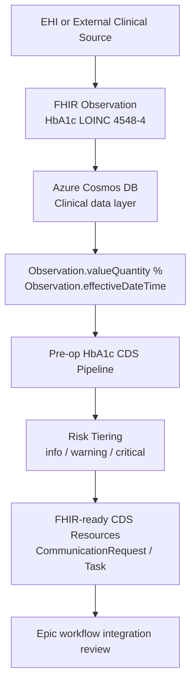

# Pre-Surgical HbA1c Risk Demo
### Clinical Decision Support (CDS) Alerts 
#### Epic EHI pre-surgical lab value for HbA1c (Hemoglobin A1c)

---
- Inputs: de-identified patient episode identifiers (`pat_eid`)

- Uses: 10 core USCDI v1 data elements in a sample clinical data shape

- Source: Azure Cosmos DB with FHIR-shaped clinical extracts

- Metric: % of patients with controlled A1C (an operational + payer quality target)

- Output: quick visualization clinicians recognize immediately

- Key Risk Value: In the Epic EHI Export schema the lab value for HbA1c (Hemoglobin A1c)

- Preoperative HbA1c optimization tiers for surgical risk review

- FHIR-ready CDS resources for Epic integration review

### Author & Acknowledgments

 - David Balkcom, MPH, Principal Data Engineer, Quality Measurement Group,
 IT Vendor Services, United States. Contact: castle.palaces8l@icloud.com.
Acknowledgments: Andrea Pitkus, PhD (testing methods alignment).

### HbA1c Specimen Clarification

A serum HbA1c test method does not exist. HbA1c measures the glucose attached to hemoglobin, which is a protein found strictly inside red blood cells. Serum is the liquid portion of the blood after the red blood cells and clotting factors have been removed, meaning it contains no hemoglobin to test. For HbA1c testing, a whole blood sample (which includes red blood cells) is always required. Laboratories process this using methods like HPLC (High-Performance Liquid Chromatography) or immunoassays.

#### App Capability Statement in a Table:

| Capability                   | Where              |
| ---------------------------- | ----------------------------- |
| Patient-level USCDI fields   | Cosmos JSON query             |
| Cohort selection by EID      | `ARRAY_CONTAINS(@eids…)`      |
| Clinically meaningful metric | Controlled diabetes           |
| Payer-relevant QI metric     | HEDIS-aligned glycemic control |
| Visualization                | Matplotlib bar chart          |

### Example External Lab Value Flow

The flow below summarizes how external HbA1c values move from EHI or another clinical source into the preoperative CDS workflow.

### Reproducible Notebook Procedure

Use [preop_hba1c_cds_workflow.ipynb](preop_hba1c_cds_workflow.ipynb) to run the demo workflow end to end.

- Default mode is `DATA_SOURCE=sample` for a credential-free walkthrough.
- Sample mode reads [sample-hba1c-cohort.json](sample-hba1c-cohort.json), a 64-patient synthetic cohort keyed by `pat_eid`.
- Base runtime dependencies are `python-dotenv pandas numpy requests matplotlib azure-cosmos`.
- Set values from `.env.example` and use `DATA_SOURCE=cosmos` to run against Azure Cosmos DB.
- FHIR delivery is review-only by default; the notebook generates `CommunicationRequest` and `Task` resources without sending them.
- The notebook records thresholds, execution date, package versions, cohort size, and FHIR preview count for replication.

#
#
#

### About this Project
## LAYER 0: DATA & WORKFLOW GOVERNANCE

### Clinical AI Orchestration Model: SWIM (data architecture)

### SIIM Workflow Initiative in Medicine (SWIM)
- The Society for Imaging Informatics in Medicine (SIIM) created SWIM as a standards-focused initiative to improve interopereable clinical workflows for medical imaging, AI model integration, and edge-to-enterprise orchestration.
- It originally began as a blueprint tool showing how data moves through  

#### Why use SWIM to model clinical workflow orchestration?
- Inside regulated workflows, the SIIM Workflow Initiative in Medicine (SWIM) is the best practical model currently available, but i 

## LAYER 1: DATA-INFRASTRUCTURE LAYER

In computing, the "data-infrastructure" provides the storage, compute, pipelines, exchange method, and procedural logging.
s data stores, schemas, provenance lineage, and semantics that downstream analyses depend on:
- In this layer, we focus on "producers" that generate content to be consumed by components further downstream in the workflow.
- Analogy: Acquiring ingredients, and preparing/cooking the food for a fine-dining meal in the kitchen.

### Event Logging
### ATNA
### IHE-SOLE

#

## LAYER 2: DATA ARCHITECTURE

DATA-ANALYTIC LAYER

#
In computing, the "analytics service layer" (ASL) delivers computed insights and the end-user experience (UX):
- The ASL leverages applied data science techniques such as forecasting, predictive analyses, causal analysis icluding causal inference (CI), forecasting, and machine learning (ML). 
- This proccess derives insights and generates visualizations for decision makers in healthcare.  
- Analogy: Plating and serving the meal with final touches in the dining room.

 

### Risk Models
- What is a risk model? A risk model is an analytic artifact that uses features engineering within the data model. 
- For example, it relies on a statistical or ML construct that predicts the answer to a scientific question of interest.
- For this project, the risk model is the foundation of the Clinical Decision Support (CDS) layer nested within the ASL.
- The risk model itself is a consumer of the data architecture, not part of it. 

### Selected Risk Model Comparison Table
| Model                                           | Low-Risk Threshold | Medium-Risk Threshold | High-Risk Threshold | Usage                               |
| ----------------------------------------------- | -----------------: | --------------------: | ------------------: |-------------------------------------|
| **Simplified Diabetes Surgical Risk Model**     |             < 7.5% |              7.5–8.5% |              > 8.5% | NSQIP Risk                          |
| **Cardiometabolic Surgical Optimization Model** |               < 7% |                  7–8% |                > 8% | Bariatric / high-risk cardiovascular |

#

---
